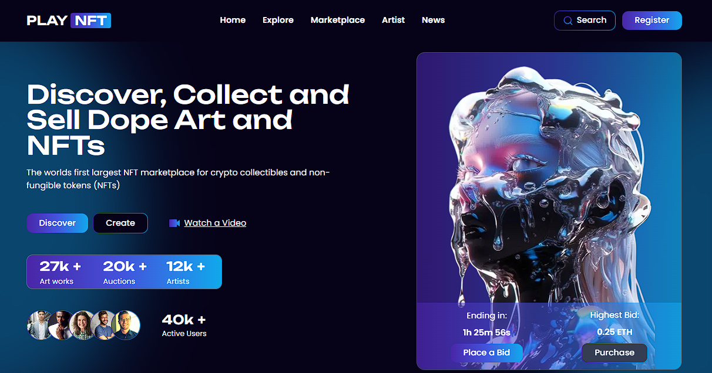

# Play NFT

The Play NFT landing page is a modern and visually appealing website design for an NFT marketplace. It was built using Next.js, Tailwind CSS, and the Dev Components library.



## Features

- Responsive and mobile-friendly design
- Clean and modern UI components
- Interactive elements for user interaction
- Customizable with Tailwind CSS
- Micro-interactions and animations

## Technologies Used

- **Next.js**: A React framework for building server-rendered applications.
- **Tailwind CSS**: A utility-first CSS framework for rapidly building custom user interfaces.
- **Dev Components**: A library of pre-built and customizable UI components.[https://dev-components.vercel.app/](https://dev-components.vercel.app/) 

## Getting Started

To run the project locally, follow these steps:

1. Clone the repository:

   ```bash
   git clone https://github.com/devyanshyadav/playNFT.git
   ```

2. Navigate to the project directory:

   ```bash
   cd playNFT
   ```

3. Install the dependencies:

   ```bash
   npm install
   ```

4. Start the development server:

   ```bash
   npm run dev
   ```

5. Open your web browser and visit `http://localhost:3000` to see the landing page.

## Design Inspiration

The design of this landing page was inspired by the Behance.net design at [https://www.behance.net/gallery/182571559/NFTs-Marektplace-Website-Landing-page-UI-UX-Design](https://www.behance.net/gallery/182571559/NFTs-Marektplace-Website-Landing-page-UI-UX-Design).
